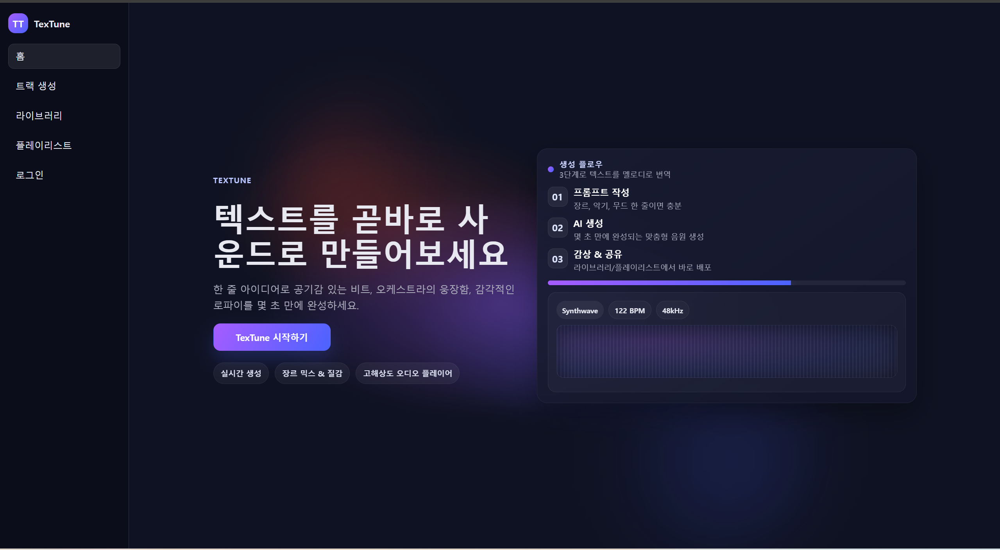
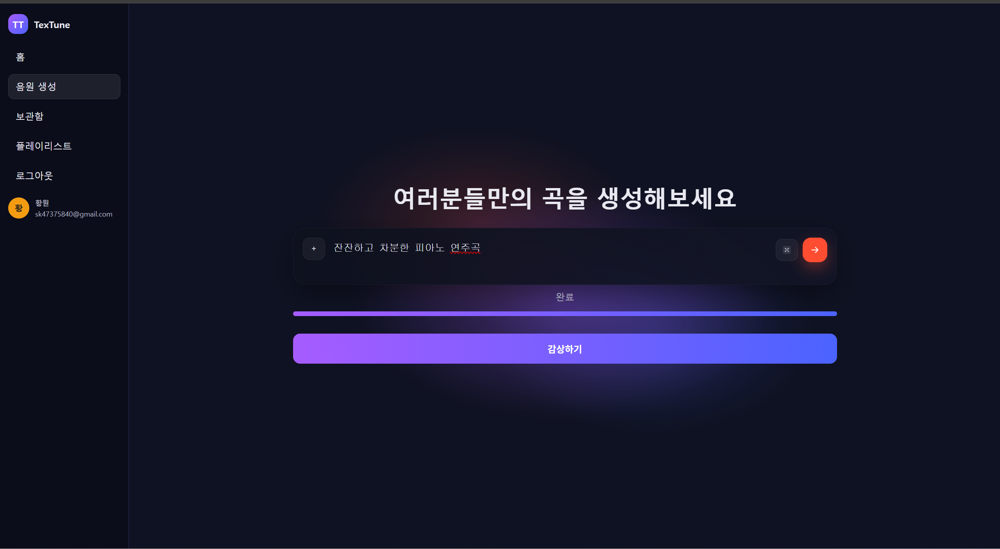
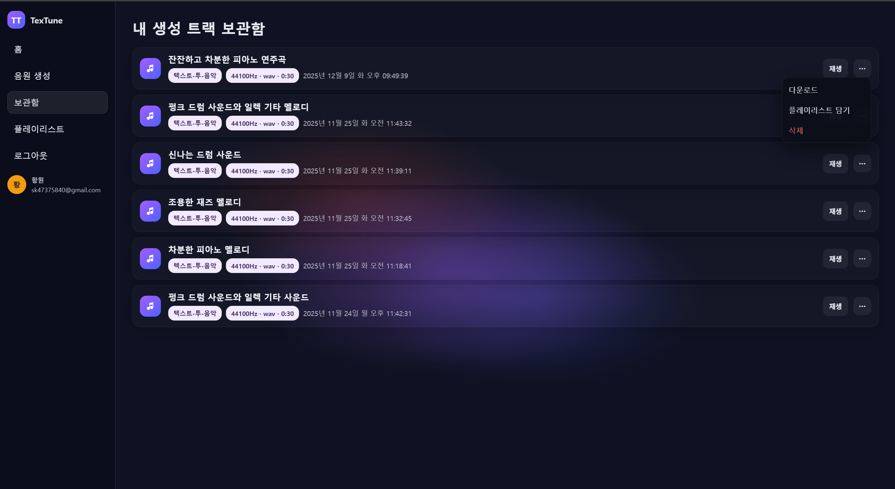
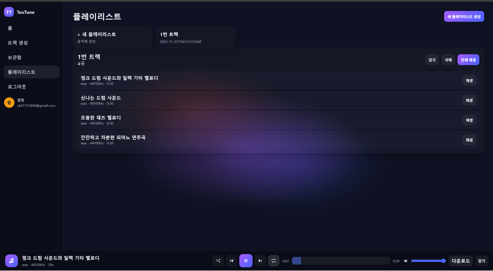

# TexTune

텍스트 프롬프트를 받아 Hugging Face Space에서 음악을 생성하고, 로컬에 저장한 뒤 웹 UI로 감상·관리할 수 있는 풀스택 MVP입니다. Express 백엔드와 정적 HTML/CSS/JS 프런트엔드를 사용하며, JWT 쿠키 인증과 인메모리 작업 큐로 간단히 운영할 수 있습니다.

## 1. 프로젝트 개요
- 목표: “텍스트 → 음악”을 몇 초 안에 끝내는 최소 기능 제품(MVP)으로, 생성·보관·재생·플레이리스트까지 하나의 흐름으로 제공.
- 특징: 백엔드가 Hugging Face Space를 대신 호출해 키를 보호하고, 결과 오디오는 로컬 스토리지와 SQLite로 관리.
- 대상: 생성형 오디오 프로토타입/데모를 빠르게 검증하려는 팀과 실험용 스튜디오 워크플로.

## 2. 핵심 기능 실행 화면
- 홈 랜딩: 텍스트 한 줄로 음악을 만들 수 있다는 메시지와 CTA.  
  - 이미지: 
- 로그인: 구글 로그인 모달 화면.  
  - 이미지: 
- 생성 페이지: 프롬프트 입력, 진행률 바, 완료 후 감상 버튼.  
  - 이미지: 
- 보관함: 생성된 트랙 목록, 재생/다운로드/삭제/플레이리스트 담기.  
  - 이미지: 
- 플레이리스트 및 글로벌 플레이어: 카드형 목록, 상세에서 전체/개별 재생, 셔플/반복/볼륨/다운로드, 상태 로컬 저장.  
  - 이미지: 

## 3. 시스템 아키텍처
- 클라이언트: 정적 HTML/CSS/JS + 글로벌 오디오 플레이어(로컬 스토리지에 상태 저장).
- API 서버: Express(`src/server.js`)에서 인증(JWT 쿠키), 생성 Job 등록/폴링, 라이브러리/플레이리스트, 파일 스트리밍 제공.
- 작업 큐: 프로세스 내 인메모리 큐(동시 1건) → Hugging Face Space 호출 전후로 진행률 추정 업데이트.
- 생성 엔진: `@gradio/client`로 Space 호출, 오디오 데이터(data URI/URL/file) 추출 후 디스크 저장.
- 저장소: SQLite(`storage/texttune.db`)에 메타데이터, 파일 시스템(`storage/{userId}/{trackId}.{ext}`)에 오디오 원본.
- 외부 연동: Hugging Face Space(필수), Google OAuth/Translation(선택).

## 4. 기술 스택
- 백엔드: Node.js 18+, Express, @gradio/client, better-sqlite3, JWT, Google Auth Library.
- 프론트엔드: 정적 HTML/CSS, vanilla JS, 글로벌 오디오 플레이어(로컬 스토리지 유지).
- 스토리지: 로컬 파일 시스템 + SQLite.
- 인증/보안: 이메일 로그인, Google OAuth(PKCE), HttpOnly JWT 쿠키, CORS 제한.
- 기타: Google Translation API(한글 프롬프트 영어 변환), Hugging Face Space ZeroGPU/토큰.

## 5. 디렉터리 맵
```
.
├─ src/
│  ├─ server.js              # Express 엔트리포인트/라우팅/큐
│  ├─ audio/spaces.js        # Hugging Face Space 호출 및 오디오 추출
│  ├─ translate/google.js    # 프롬프트 번역(Google Translation API)
│  ├─ db/                    # better-sqlite3 스키마 및 레포지토리
│  └─ utils/http.js          # fetch 존재 여부 확인
├─ public/
│  ├─ index.html             # 홈 랜딩
│  ├─ generate.html          # 생성 UI
│  ├─ library.html           # 보관함/재생/플레이리스트 진입
│  ├─ playlist.html          # 플레이리스트 UI
│  ├─ track.html             # 단일 트랙 상세
│  ├─ css/*.css              # 페이지별 스타일
│  └─ js/app.js              # 공용 스크립트/글로벌 플레이어
├─ storage/                  # 생성된 오디오 파일 + SQLite DB(texttune.db)
├─ package.json              # 스크립트/의존성
└─ .env                      # 환경 변수(예시 값, 배포 시 비워서 설정)
```

## 6. 설치 및 실행
```bash
npm install
npm run init-db   # 최초 1회: storage/texttune.db 생성
npm start         # http://localhost:4000
```
Express가 `public/`을 정적으로 서빙하므로 별도 프런트 빌드가 없습니다.

## 7. 환경 변수(.env 예시)
```
PORT=4000
JWT_SECRET=change-me
ALLOW_ORIGIN=http://localhost:4000
MAX_DURATION_SECONDS=30
DEFAULT_DURATION_SECONDS=30

# Hugging Face
HF_SPACE_ID=TheStageAI/Elastic-musicgen-large
HF_API_TOKEN=hf_xxx   # 비공개 Space이거나 ZeroGPU 쿼터 확장 시 필요

# Prompt translation (optional)
GOOGLE_TRANSLATE_API_KEY=your_google_translation_key
GOOGLE_TRANSLATE_SOURCE_LANG=ko
GOOGLE_TRANSLATE_TARGET_LANG=en

# Google OAuth (선택)
GOOGLE_CLIENT_ID=...
GOOGLE_CLIENT_SECRET=...
GOOGLE_REDIRECT_URI=http://localhost:4000/v1/auth/google/callback
```
- 실서비스에서는 `.env`를 커밋하지 말고, 위 값들을 개별 발급/회전하세요.

## 8. 사용자 플로우(UX)
1) 랜딩 → 로그인  
   - `index.html`에서 “TexTune 시작하기” 클릭 → 로그인 모달(이메일/Google OAuth) → 쿠키로 세션 유지.  
2) 트랙 생성  
   - `generate.html`에서 프롬프트 작성(랜덤 제안 버튼 포함) → `/v1/generations` 요청 → 진행률 바 실시간 업데이트 → 완료 시 “감상하기” 버튼으로 보관함 이동.  
3) 보관함/재생  
   - `library.html`에서 생성된 트랙 목록 확인, 재생 클릭 시 하단 글로벌 플레이어가 열리고 스트리밍/다운로드/삭제/플레이리스트 추가 가능.  
4) 플레이리스트  
   - `playlist.html`에서 새 플레이리스트 생성 → 카드 선택 시 트랙 목록/전체 재생/개별 재생 가능.  
5) 트랙 상세  
   - `track.html?id={trackId}`로 직접 접근하거나 보관함에서 이동해 단일 오디오 플레이어, 메타데이터, 동일 프롬프트 재생성 버튼 제공.  
6) 글로벌 플레이어  
   - 모든 페이지 하단에 고정. 셔플/반복/볼륨/다운로드 제공, 로컬 스토리지로 상태를 기억해 페이지 이동 후에도 이어서 재생.

## 9. 주요 API 요약
- 인증: `POST /v1/auth/login`, `POST /v1/auth/logout`, `GET /v1/me`, `PATCH /v1/me`, `GET /v1/auth/google/*`
- 생성: `POST /v1/generations`, `GET /v1/generations/:id`
- 라이브러리: `GET /v1/library`, `DELETE /v1/library/:id`
- 트랙: `GET /v1/tracks/:id`, `GET /v1/stream/:id`, `GET /v1/download/:id`
- 플레이리스트: `GET/POST /v1/playlists`, `GET /v1/playlists/:id`, `POST /v1/playlists/:id/tracks`, `DELETE /v1/playlists/:playlistId`, `DELETE /v1/playlists/:playlistId/tracks/:trackId`

## 10. 운영/제한 사항
- 단일 프로세스 인메모리 큐이므로 멀티 인스턴스/수평 확장 시 외부 큐(예: Redis)로 대체가 필요합니다.
- 파일 경로는 `storage/` 하드코딩 기반이므로 컨테이너 재시작 시 데이터를 유지하려면 볼륨 마운트가 필수입니다.
- 글로벌 플레이어/플레이리스트 UI 일부에 인코딩 깨짐이 존재할 수 있으니 배포 전에 폰트/문자셋 검증을 권장합니다.
- Node 런타임에 `fetch`가 없으면 `translate/google.js`/`spaces.js`가 실패하므로 Node 18+를 사용하거나 폴리필을 추가하세요.
